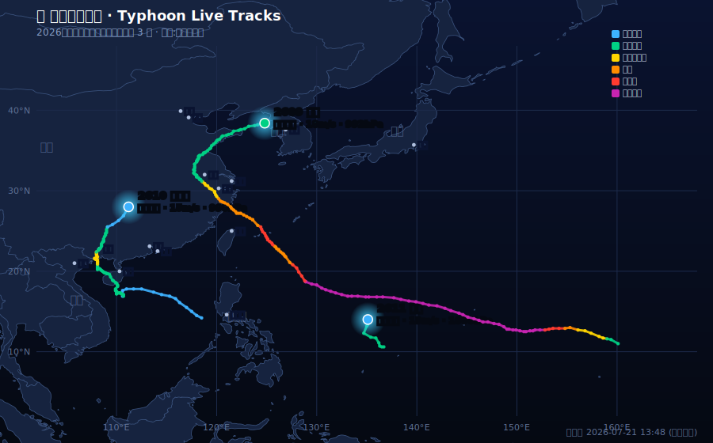

<div align="center">

# 台风三维追踪 · Typhoon 3D Globe Tracker

基于 **CesiumJS** 的三维地球台风实时追踪可视化。**纯前端 · 无需后端 · 打开即用。**

[](https://liyurun.github.io/typhoon-3d-tracker/)
[](./LICENSE)
[](https://cesium.com/platform/cesiumjs/)

**🌐 在线体验 → https://liyurun.github.io/typhoon-3d-tracker/**

<br/>

### 🛰️ 当前台风实时路径（每 3 小时自动更新）



<sub>图片由 GitHub Action 定时抓取中央气象台数据自动生成，无需人工维护。点击上方「在线体验」查看可交互的三维版本。</sub>

</div>

---

## ✨ 项目简介

在三维地球上实时查看台风的真实位置、路径、强度与卫星云图。所有数据均由浏览器**直接调用公开接口**获取，**无需克隆项目、无需部署后端**，打开网页即可使用。

## 📸 主要功能

- 🌍 CesiumJS 三维球形地球 + 真实三维高程地形（Cesium World Terrain）
- 🌀 中央气象台多台风实时路径、预报路径、观测点、台风眼、七级风圈
- 🎨 台风强度分级配色（热带低压 → 超强台风）
- ☁️ NASA GIBS 卫星云图叠加（葵花 / GOES / VIIRS，可切换、可调透明度）
- 💨 动态风场粒子动画（Open-Meteo 实时 10m 风，按风速着色）
- 🗺️ 多底图切换（地形图 / 晕渲地形等）
- ✨ 真实星空天空盒 + 大气辉光 + 昼夜光照 + HDR/FXAA/Bloom
- ⏱️ 回放、自动刷新、全景等交互控件

## 🔌 数据来源

| 数据 | 来源接口 | 是否需要 Key |
|------|----------|--------------|
| 台风实时/历史路径 | 中央气象台 `typhoon.nmc.cn` | 否 |
| 卫星云图 | NASA GIBS `gibs.earthdata.nasa.gov` | 否 |
| 动态风场（10m 风） | Open-Meteo `api.open-meteo.com` | 否 |
| 三维地形高程 | Cesium Ion World Terrain | **需要免费 Token** |
| 底图瓦片 | Google / CartoDB / NASA GIBS 等 | 否 |

## 📂 目录结构

```
.
├── index.html        # 页面入口（UI 布局、样式、面板）
├── app.js            # 核心逻辑：台风数据拉取/解析、Cesium 地球、图层切换、交互
├── wind-layer.js     # 动态风场粒子引擎（Canvas 叠加层）
├── wind-sample.json  # 风场接口失败时的内置回退样例数据
├── cesium/           # 本地打包的 CesiumJS 1.121 库（离线可用）
├── .nojekyll         # 告知 GitHub Pages 跳过 Jekyll 处理
└── LICENSE
```

## 🚀 本地运行

因为使用了 `fetch` 与本地 Cesium 资源，**不能直接双击 `index.html`**（会有跨域/路径问题），需要一个本地静态服务器：

```bash
# 方式一：Python（自带）
python3 -m http.server 8080

# 方式二：Node
npx serve .        # 或 npx http-server -p 8080
```

然后浏览器打开 `http://localhost:8080/`。

## 🌐 部署到 GitHub Pages

本项目是纯静态资源，可一键部署：

1. 进入仓库 **Settings → Pages**；
2. **Source** 选择 `Deploy from a branch`；
3. **Branch** 选择 `main`、目录选择 `/ (root)`，保存；
4. 稍等 1–2 分钟，访问 `https://<你的用户名>.github.io/typhoon-3d-tracker/`。

> 仓库根目录已包含 `.nojekyll` 文件，确保 Cesium 的静态资源不被 Jekyll 过滤。

## 🔑 替换 Cesium Ion Token（三维地形）

项目在 `app.js` 顶部内置了一个 Cesium Ion 免费 Token 用于加载三维地形。**建议替换为你自己的，并限制使用域名**：

1. 到 https://cesium.com/ion 免费注册；
2. 复制默认 Access Token；
3. 打开 `app.js`，找到 `Cesium.Ion.defaultAccessToken = "..."`，替换为你的 Token；
4. 在 Cesium Ion 控制台的 Token 设置里，将 **Allowed URLs** 限制为你的 Pages 域名，防止配额被他人盗用。

> Ion 免费套餐含全球地形，个人使用足够；超出每月配额时页面会自动降级为平滑球面，不会白屏。

## ⚠️ 已知注意事项

- **网络可达性**：部分底图源（Google、ESRI、Bing）在中国大陆可能被屏蔽或很慢，导致地球表面显示为黑色。建议默认使用 NASA GIBS / CartoDB 等在国内可访问的源。
- **地形 Token**：示例 Token 有流量配额，正式使用请替换为自己的。
- **Open-Meteo 限流**：风场接口偶发 429 限流，此时自动回退到 `wind-sample.json` 样例数据。

## 🙏 致谢

- [CesiumJS](https://cesium.com/platform/cesiumjs/) — 三维地球引擎
- [中央气象台台风网](https://typhoon.nmc.cn/) — 台风路径数据
- [NASA GIBS](https://wiki.earthdata.nasa.gov/display/GIBS) — 卫星云图
- [Open-Meteo](https://open-meteo.com/) — 风场数据

## 📄 License

本项目基于 [MIT License](./LICENSE) 开源。
